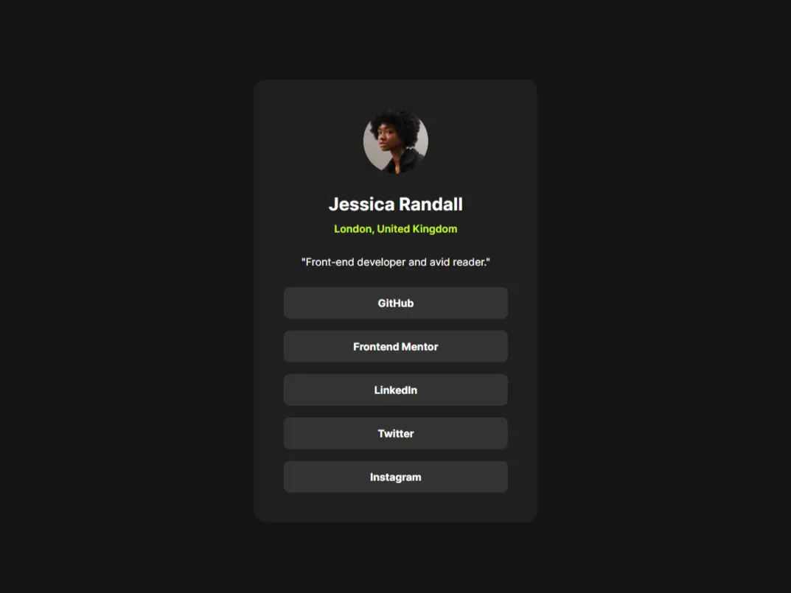

# Frontend Mentor - Social links profile solution

This is a solution to the [Social links profile challenge on Frontend Mentor](https://www.frontendmentor.io/challenges/social-links-profile-UG32l9m6dQ). Frontend Mentor challenges help you improve your coding skills by building realistic projects. 

## Table of contents

- [Overview](#overview)
  - [The challenge](#the-challenge)
  - [Screenshot](#screenshot)
  - [Links](#links)
- [My process](#my-process)
  - [Built with](#built-with)
  - [Continued development](#continued-development)
- [Author](#author)

## Overview

### The challenge

Users should be able to:

- See hover and focus states for all interactive elements on the page

### Screenshot

### Links

- [Solution URL](https://github.com/al-burtsev/social-links-profile)
- [Live Site URL](https://al-burtsev.github.io/social-links-profile)

## My process

### Built with

- Semantic HTML5 markup
- CSS custom properties
- Flexbox
- Mobile-first workflow

### Continued development

I want to focusing on 
- CSS properties depending on its writing mode (min-block-size, min-inline-size, margin-block/inline, padding-block/inline)
- Animations

 in future projects.

## Author

- [Frontend Mentor](https://www.frontendmentor.io/profile/al-burtsev)
- [TG](https://t.me/al_burtsevv)

